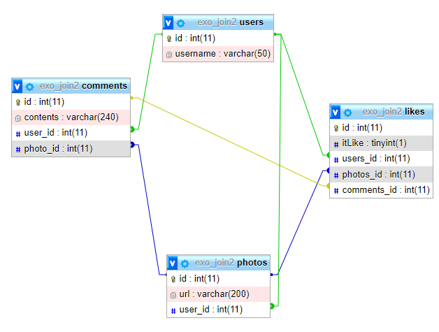

# INSTAGRAM

Création de requête SQL pour un projet instagram.

## Modélisation de ma bdd



### 1.Pour tous les commentaires,afficher so contenu et l’url de la photo à laquel le commentaire a été    ajouté
```SQL
SELECT DISTINCT comments.contents,users.username FROM comments JOIN users ON users.id =comments.user_id
```

### 2.Pour chaque commentaire, afficher son contenu et l'url de la photo à laquel le commentaire a été ajouté
```SQL
SELECT DISTINCT comments.contents,users.username FROM comments JOIN users ON users.id =comments.user_id
```
### 3.Afficher l'url de chaque photo et le nom d'utilisateur de l'auteur
```SQL
SELECT photos.url,users.username FROM photos JOIN users ON photos.user_id =users.id
```
### 4.Trouver tous les commentaires pour la photo d'id 3, avec le username de l'utilisateur qui a commenté
```SQL
SELECT comments.contents,users.username,photos.id AS NumDePhoto FROM comments JOIN users ON users.id=comments.user_id JOIN photos ON photos.id=comments.photo_id WHERE photos.id=3
```
### 5.Trouver tous les url des photos ainsi que tous les commentaire qui ont été posté par l'auteur de la photo
```SQL
SELECT DISTINCT photos.user_id,photos.url AS URL,photos.id AS idPhoto, comments.id AS commentid,comments.user_id AS idUserComments, users.username, comments.contents FROM comments JOIN users ON comments.user_id = users.id JOIN photos ON photos.user_id = users.id WHERE photos.user_id = users.id
```
### 6.Le nombre de likes pour la photo d’ID 4
```SQL
SELECT  * FROM likes JOIN photos ON likes.photos_id=photos.id WHERE photos.id=4
```
